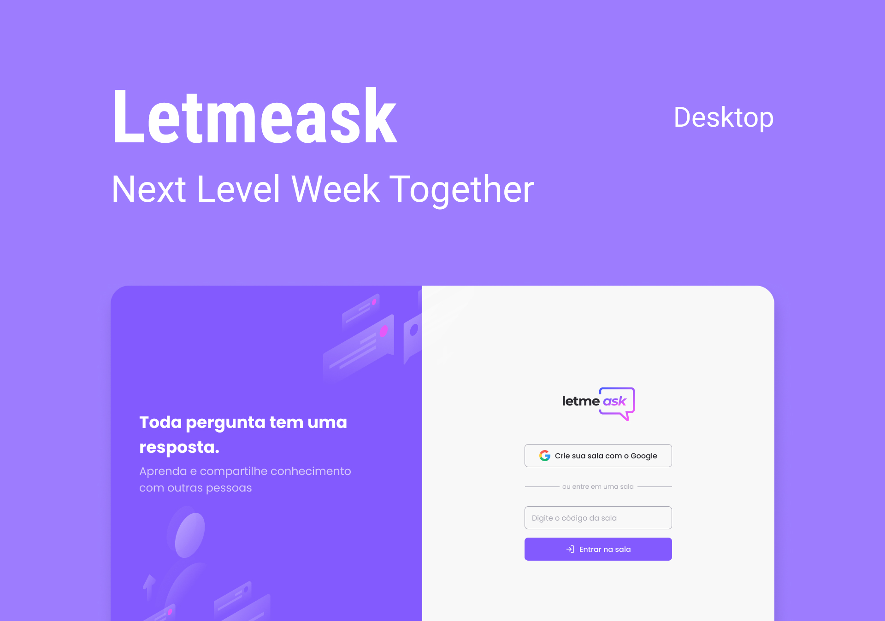

<p align="center">
  
</p>

### ♟ Summary

<p align="center">
  <a href="#-preview">Preview</a>&nbsp;&nbsp;|&nbsp;&nbsp;
  <a href="#-live-preview">Live Preview</a>&nbsp;&nbsp;|&nbsp;&nbsp;
  <a href="#-technologies-used">Technologies</a>&nbsp;&nbsp;|&nbsp;&nbsp;
  <a href="#-project">Project</a>&nbsp;&nbsp;|&nbsp;&nbsp;
  <a href="#-layout">Layout</a>&nbsp;&nbsp;|&nbsp;&nbsp;
  <a href="#-instructions">Instructions</a>&nbsp;&nbsp;|&nbsp;&nbsp;
  <a href="#-license">License</a>&nbsp;&nbsp;|&nbsp;&nbsp;
  <a href="#-development">Development</a>
</p>

### 📱 Preview

<p align="center">
  
</p>

### 💻 Live Preview

- [Vercel]()

### 📚 Technologies used

This project was developed with the following technologies:

- [React](https://reactjs.org/)
- [TypeScript](https://www.typescriptlang.org/)
- [Firebase](https://firebase.google.com/)
- SCSS

### 🚀 Project

**Letmeask** is a perfect web project for content creators to be able to create **Q&A** rooms with their audience, in a very organized and democratic way.

### 🎨 Layout

You can view the project layout [here](<(https://www.figma.com/community/file/1009824839797878169/Letmeask)>). Remembering that you need to have a [Figma](http://figma.com/) account.

### 🎓 Instructions

**Clone** the repository

```bash
git clone https://github.com/vargastm/letmeask.git
```

To run **Letmeask** - Open the **letmeask** folder with the terminal and **run** the commands:

```bash
npm install
npm start
```

> Server will be running on localhost:3000

_Remembering that you will need to create a [Firebase](https://firebase.google.com/) account and a project to provide a Realtime Database._

<br>

### 📝 License

**Letmeask** is released under the [MIT License](./LICENSE) para mais detalhes.

---

### 👨‍💻 Development

Developed with 💜 by **Tiago Martins Vargas** and all thanks to **Rocketseat** for the **NLW together**.
